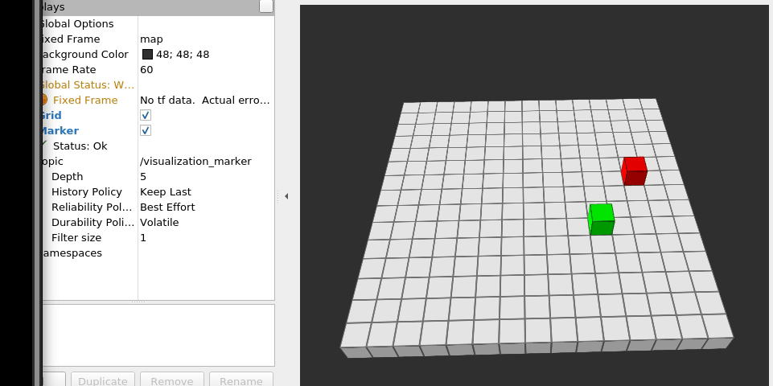

# rviz-snake

A game of snake in rviz2; This was made for fun as an introduction for ROS2.

## Requirements
Currently, this has only been tested for `rclcpp` for ROS2 Galactic, though it is very likely it will work perfectly fine on anything slightly older. In addition, you'll need to have rviz2 installed and ncurses (for user input) installed via `sudo apt-get install libncurses-dev`.

## Running 
Firstly, [source your ros2 installation](https://docs.ros.org/en/galactic/Tutorials/Configuring-ROS2-Environment.html#source-the-setup-files). 

1. Build the project by heading into the root directory and running `colcon build`.
2. Source project via `source install/setup.bash`.
3. Run the game via `ros2 run snake_publisher publisher`. 
4. In a separate terminal, run `rviz2 src/snake_publisher/rvizSetup.rviz`.

With that, the game should run. Input is taken at the terminal where `ros2 run` was run.

## Limitations / Bugs
1. No launch file is provided (I could make one in the future)
2. Game will crash if you are good enough to fill up the entire board.
3. After awhile, messages will slowly be delayed by a noticable amount; Simply restart rviz2. 
